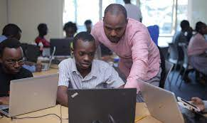

# Week one independent project

This is week one project done to evaluate on the whole week's content on web development.
---
### Areas covered
1. HTML - HTML is the standard markup language for Web pages. With HTML you can create your own Website. HTML is easy to learn. [HTML](https://www.w3schools.com/html/)
2. CSS - CSS is the language we use to style an HTML document. CSS describes how HTML elements should be displayed. [CSS](https://www.w3schools.com/css/)
3. GIT - GitHub is a code hosting platform for version control and collaboration. It lets you and others work together on projects from anywhere. [Git](https://docs.github.com/en/get-started/quickstart/)

---

## Technical mentors
---
|Name | County | Gender|
| ----------- | ----------- |----------|
| Albert Byrone | Nairobi | Male  |
| Rose Oketch  | Nairobi  | Female|
| Odak| Nairobi  | Male  |
| Samuel Hinga| Nairobi| Male  |

---
## License and Copyright
---
### ©Gilbert c korir, Moringa school software development.

Licensed under [MIT LICENSE](LICENSE)

